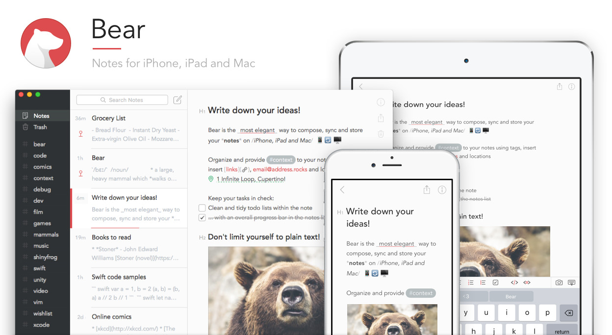
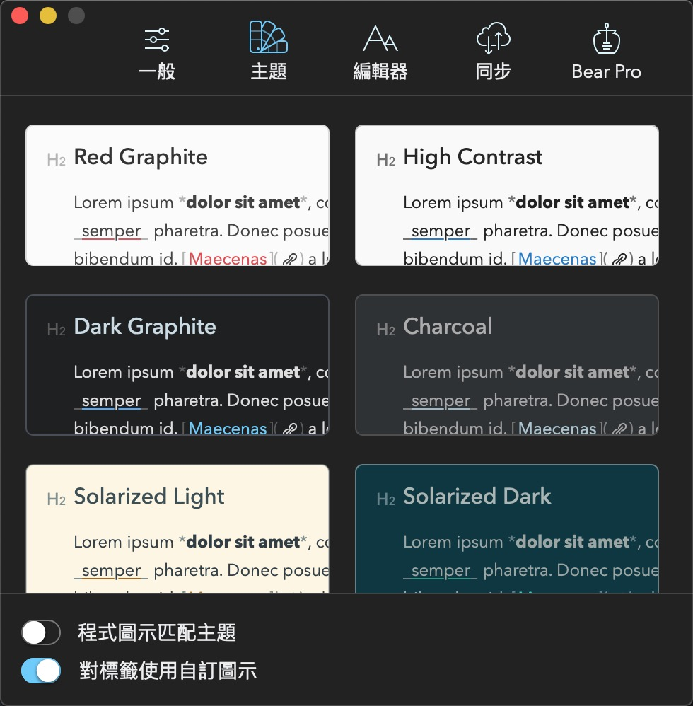
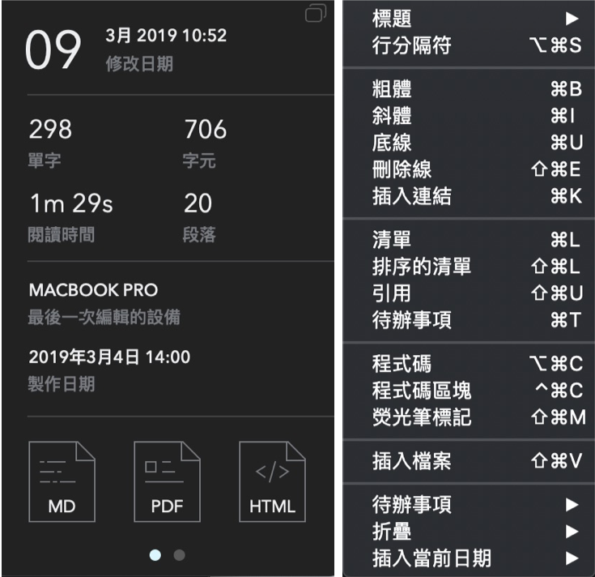

## 前言
自從evernote免費版開始限制只能同時在2台裝置上登入後，我就開始尋找另外一款可以取代evernote的筆記軟體。

期間試過了OneNote、Apple Notes以及Day One，但最後選擇了Bear這套筆記軟體，現在就來介紹一下這套軟體吧！

## Bear - 在iPhone、iPad以及Mac上優雅的寫作

Bear是一套於各裝置都可以免費使用的筆記軟體，付費訂閱後可以得到的是跨裝置間同步、額外的主題以及可以選擇更多的匯出格式。

<!--more-->

## 為什麼我選擇Bear ？
在用Bear的時候幫助自己最多的是在跨裝置之間的寫作，在通勤的時候用手機記錄一些想要寫的大綱，回到家後打開電腦就可以馬上接著繼續寫下去，這歸功於Bear流暢的同步功能！

而在電腦上使用時可以選擇「只顯示編輯器」的模式，讓自己可以不受其他不相干的視窗干擾，專注在寫作上。

另外，Bear也跟evernote一樣，有針對瀏覽器提供「網頁截取」的擴充功能，看到喜歡的網頁文章時可以隨時截取下來，等有空的時候再來整理。

還有更多功能如「標籤分類」、「標籤icon」以及「程式碼標記(highlight)」這些功能就不一一介紹，就讓大家自己試用看看囉！

## 結論
最後條列一下自己覺得Bear這套筆記軟體的優缺點，供大家做為參考。

### 優點
* 支援Markdown語法，即時預覽文章內容
* 各裝置間同步流暢且迅速
* 多款主題風格可使用（訂閱後可用16種主題）
* 可以使用hashtag分類，甚至可以用成資料夾（例如 #實用工具/筆記軟體#
* 多種匯出格式：PDF, RTF, DOCX, HTML, TXT and MD
* 可以做筆記連結，筆記間可以快速跳轉

### 缺點
* 不支援windows和Android系統，對於跨平台的使用者來講較不方便。目前開發者有在開發web版本
* 不支援表格格式，開發者表示有在考慮要開發
* 不支援圖片編輯
* 月租費$40，尚無買斷版

以上是我對 Bear 這套筆記軟體的想法，如果你有什麼問題想要詢問或是有其他類似工具想要推薦的，都歡迎你留言與我討論。
