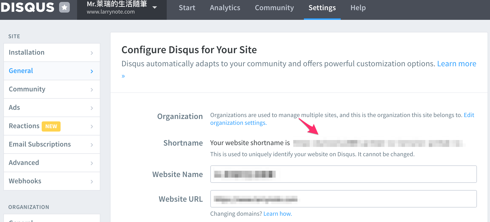
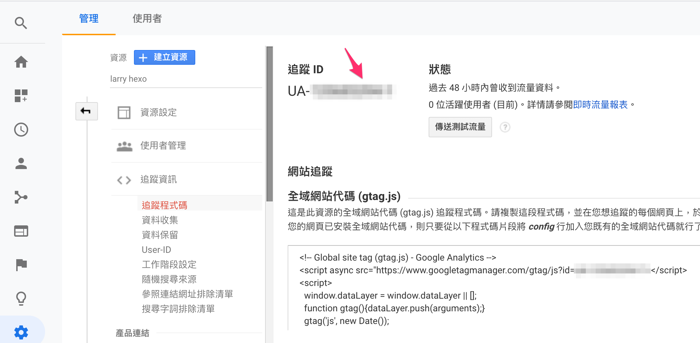
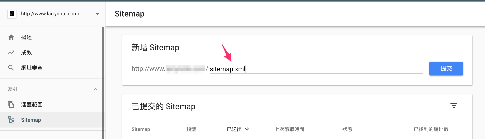

## 前言
在使用Hexo這個網誌框架之前，曾經使用過非常受歡迎的Wordpress架站服務。

Wordpress雖然是個很棒的內容管理系統(CMS)，佈景主題很漂亮，但最大的缺點就是站體很容易過於龐大，如果是用免費的雲端伺服器的話網頁讀取速度可以說是非常慢，而且因為資料都在雲端伺服器，在備份和還原上稍微較麻煩。

而Hexo這個輕量級的網誌框架就解決了**讀取速度**這個對我來講最大的問題，而且剛好可以搭配[Github Pages](https://pages.github.com/))這個免費服務來進行網站搭建。

以下的教學是針對使用MacOS的人所寫的，如果是使用Windows系統的話步驟基本上一樣，只是指令的部分可能會有點差異，還請見諒。

<!--more-->

## Hexo介紹
Hexo是一個能夠產生靜態網站的網誌框架，相對於動態網站需要有一個資料庫，靜態網站的檔案存在電腦上，將來在轉移的時候也比較方便。

Hexo的一些優點
* 超快的檔案產生速度，在幾秒內即可完成網誌產檔
* 近300個外掛插件
* 有200多個免費主題
* Markdown支援

## 建立使用Hexo的環境
### 事前準備
在安裝Hexo前電腦需要先安裝下列兩套軟體。
* [Node.js](https://nodejs.org/en/)
* [Git](https://sourceforge.net/projects/git-osx-installer/)

如果還沒裝的話可以點擊上方超連結至官網安裝。

### 安裝Hexo
於終端機中透過 npm 安裝Hexo [1]

`$ npm install -g hexo-cli`

如遇到node.js的write access問題可以參考備註1的解決方案。

### 建立部落格
輸入`$ hexo init <部落格名稱>`進行hexo的初始化，並在剛剛創建好的資料夾內安裝npm套件。

完整程式碼如下
```
$ hexo init blog #建立部落格
$ cd blog #載入資料夾
$ npm install #安裝npm套件
```

接著可以先啟動local端的server來看看一下自己的部落格長怎樣。
```
$ cd blog
$ hexo server #啟動本地端server
```
看到自己的部落格後先不要感動落淚，我們先來介紹幾個比較重要的檔案。

### 目錄結構
#### _config.yml
網站的配置檔案，可以設定網站標題、作者、作者大頭貼、網域...等，是非場重要的一個檔案。
#### source
原始檔案資料夾是放置內容的地方。裡面的`_posts`資料夾是存放文章的地方，之後要新產生的文章都會在這邊。
#### theme
放置主題的資料夾。

## 開始設定
### 網站基本設定
建立完網誌後，我們可以先打開`_config.yml`這的檔案來設定一些基本的內容。
```
title: 網站標題
subtitle: 網站副標題
description: 網站描述
keywords: 網站關鍵字
author: 作者名稱
language: zh-TW
timezone: Asia/Taipei
```
語言預設是英文，也可以設定成`zh-TW`改成中文，時區預設是你電腦的時區，也可跟我一樣改成台灣的時區。

### 主題設置
本篇文章主要是以使用NexT這套簡潔且集合了許多第三方外掛的強大主題來做說明。

首先載入自己的網誌資料夾(本文章的教學範例是blog)，並且將主題檔案從Github端上載下來到本地端。
```
$ cd blog
$ git clone https://github.com/theme-next/hexo-theme-next themes/next #將next的主題資料從github載下來放在next資料夾裡
```
打開網站設定檔`config.yml`，將`theme:landscape`改成`theme:next`，新的主題就套用成功了！

現在我們來輸入`hexo generate`讓hexo產生靜態檔案[2]，並且使用`hexo server`來啟動伺服器。
```
$ hexo generate #產生靜態檔案
$ hexo server
```
在瀏覽器中輸入 localhost:4000 ，可以看見新主題已經成功套用。

### 作者資訊設定
在`theme/next`這個資料夾中打開主題的設定檔`_config.yml`，url設定如下。並在`blog/source/uploads/images`的資料夾中放入你想要的大頭照，並命名為avatar.jpg
```
avatar:
    url: /uploads/images/avatar.jpg
```

### 加入社群連結
在主題設定檔`_config.yml`，設定各社群媒體的連結，把前面的#字號去掉就是開啟該社群連結的意思。
```
social:
  #Google: https://plus.google.com/yourname || google
  #Twitter: https://twitter.com/yourname || twitter
  FB Page: https://www.facebook.com/larrynote || facebook
```

## 開始寫作
### 第一篇文章
前面講了這麼多終於要開始介紹怎麼寫文章囉！

首先一樣要透過終端機先進入自己的blog資料夾，再執行`hexo new <文章名稱>`，就會在路徑`blog/source/_posts`內創建一個`文章名稱.md`的檔案。

接下來就可以用文字編輯器打開`文章名稱.md`進行撰寫。[3]

另外這邊建議在網站設定檔`config.yml`的中可以將`post_asset_folder: false`改成`post_asset_folder: true`，這樣之後在用`hexo new`創建新文章的時候會建立一個該文章的對應資料夾，可以在該資料夾中放入該文章圖片，這樣比較好方便管理。

### 文章設定
當你在打開文章檔案時，預設可以做以下設定。
```
---
title: {{ title }} #文章標題，不用動它
date: {{ date }}   #文章創建日期
tags:              #標籤（多標籤寫法如下）
- tag1
- tag2
---
```
可以在上方區塊中為文章加入更多詳細設置，例如文章分類、SEO會用到的關鍵字和敘述設定。
```
categories: #文章分類
keywords:   #關鍵字(SEO用)
decription: #文章敘述
```
這邊建議可以直接修改`blog/scaffolds/post.md`這個文章模板檔案，此檔案就是每次執行`hexo new <文章名稱>`指令時的會產生的文章模板。

### 加入「繼續閱讀」按鈕
在文章斷點處加入`<!--more-->`就可以囉！

例如以下程式碼就只會在首頁顯示”我是第一段”的文字，”我是第二段則是需要點「繼續閱讀」才會出現”
```
我是第一段
<!--more-->
我是第二段
```

## 新增網站頁面
我們先來創建一個**分類**頁面，於終端機中輸入`hexo new page categories`這個指令。

在`blog/source/categories/` 路徑中找到`index.md`這個檔案，打開檔案，並增加頁面的type屬性。建議可以關閉頁面的評論功能（預設是開啟）
```
---
title: categories
date: 2019-03-19 12:12:12
type: "categories"
comments: false
---
```
打開主題設定檔`config.yml`，找到以下程式碼，把前方的categories的註解#給刪掉。
```
menu:
  home: / || home
  #about: /about/ || user
  #tags: /tags/ || tags
  categories: /categories/ || th
  archives: /archives/ || archive
  #schedule: /schedule/ || calendar
  #sitemap: /sitemap.xml || sitemap
  #commonweal: /404/ || heartbeat
```

## 將網站佈署至GitHub Pages
終於來到了要讓大家能看到你的部落格的階段，我在這裡選擇了免費又穩定的[GitHub Pages ](https://pages.github.com/)這套服務。

GitHub Pages官方介紹
> Websites for you and your projects, hosted directly from your GitHub repository. Just edit, push, and your changes are live.

使用Github創建一個名稱為`<username>.github.io`的專案，例如`larryblog.github.io`。

執行`npm install hexo-deployer-git —save`這個外掛，讓Hexo可以執行指令部署至Github上。

在網站設定檔`config.yml`找到deploy並進行以下修改
```
deploy:
  type: git
  repo: https://github.com/skylovely2005/larrylai.github.io.git #新建專案的網址
  branch: master #Github Pages的是以master這個分支作為顯示頁面
```

另外找到url並進行以下設定
```
url: https://username.github.io/
root: /repo.github.io/
```
假設我Github的帳號名稱為larry，並且剛剛創建了`larryblog.github.io`這個專案，那程式碼修改如下：
```
url: https://larry.github.io/
root: /larryblog.github.io/
```

現在執行`hexo deploy`指令，將網站部署到Github Pages上。

接下來就可以輸入到你的網站`https://username.github.io/reop.github.io`來看到你的網站囉！ [4]

例如https://larry.github.io/larryblog.github.io

## 實用外掛推薦
現在要來介紹幾個實用的外掛，大家可以參考斟酌要不要用，或是可以自己到官方的[外掛列表](https://hexo.io/plugins/)來找到適合自己的外掛。

設置好外掛後，都需要先執行`hexo generate`來產生新的靜態檔案，然後再執行`hexo server`於本地端進行測試。

### 為部落格增加搜索功能
執行 `npm install hexo-generator-search`安裝外掛，並在主題設定檔`config.yml`中找到`local_search`將`enable: false`改成`enable: true`
```
local_search:
  enable: true
```
### 使用Disqus為文章加入留言功能
1. 首先要到[Disqus](https://disqus.com/)網站去申請一個帳號，並且新增一個「網站」。
2. 到setting的General中找到該網站的Shortname並複製起來

3. 回到主題設定檔`config.yml`中找到以下程式碼，並把剛剛複製好的貼在shortname後面。
```
disqus:
  enable: true                    #開啟功能
  shortname: https-username-web
  count: true                     #在文章中顯示評論數量
  lazyload: false                 #延遲載入功能
```
### 加入Google Analytics紀錄網站流量
#### 取得追蹤碼
於[Google Analytics](https://analytics.google.com/analytics)中建立新帳戶，並至資源設定 -> 追蹤資訊 -> 追蹤程式碼，找到追蹤ID`UA-123456789-1`，並把他複製起來。

#### 完成GA設置
於主題的設定檔`config.yml`中加入自己的tracking_id，建議將本地端的流量忽略掉，這樣在計算上比較準確
```
# Google Analytics
google_analytics:
  tracking_id: UA-123456789-1
  localhost_ignored: true
```
### Google SEO優化
#### 申請帳號，並使用GA驗證
先至[Google Search Console](https://search.google.com/search-console/about?hl=zh-tw)將你的網站網址新增至資源中，由於剛剛加了Google Analytics至你的部落格中，所以驗證方法可以用Google Analytics帳戶來進行驗證。
#### 提交sitemap
執行`hexo-sitemap-generator`安裝外掛。

在網站設置的`config.yml`中，新增路徑，讓sitemap可以順利提交。
```
sitemap:
  path: sitemap.xml
```

執行指令提交sitemap
```
hexo generate
hexo deploy
```

回到[Google Search Console](https://search.google.com/search-console/about?hl=zh-tw)內的索引 -> Sitemap中提交sitemap的網址（寫`sitemap.xml`）。


接下來就等Google解析你的網址啦！通常過幾天後就能夠搜尋到自己的網站了。

### 全站訪客及文章閱讀人數統計
使用集合在NexT主題中的[不蒜子](http://ibruce.info/2015/04/04/busuanzi/)計數套件即可。

打開主題的配置檔案`config.yml`，並且找到`busuanzi_count`，並輸入以下指令。
```
busuanzi_count:
  enable: true
  total_visitors: true 
  total_visitors_icon: user
  total_views: true
  total_views_icon: eye
  post_views: true
  post_views_icon: eye

```

接下來一樣執行`hexo generate`後就可以看到部落格中已經添加了全站瀏覽數統計以及文章閱讀數統計了。


## Hexo 常用指令
```
hexo generate      #產生靜態檔案
hexo deploy        #部署至github
hexo server        #啟動本地端server
hexo new <post>    #新增文章
hexo clean         #清除現有的靜態檔案
```

## 總結
以上是使用Hexo這個網誌框架的教學，希望能夠幫助你們順利使用Hexo這套網誌框架，如果有任何關於hexo的問題或是更進階的使用技巧想要知道的話，歡迎在下方留言與我討論。

下一篇文章會在教大家如何綁定自己的網域，讓網站的網址變得比較漂亮。

## 參考資料
* [Hexo 官方網站](https://hexo.io/zh-tw/index.html)
* [Hexo 外掛清單](https://hexo.io/plugins/)
* [NexT 主題官方網站](https://theme-next.iissnan.com/)

## 備註
* [1]：遇到node.js的write access問題，可以嘗試以下解決方法。
	1. 利用 `—unsafe-perm` 指令繞過系統限制，完整指令如下
	2. 透過指令更新npm`sudo npm install —unsafe-perm —verbose -g npm`
	3. 安裝hexo所需檔案 `sudo npm install —unsafe-perm hexo-cli -g`
* [2]：之後每次更新網站或文章都需要透過這個指令來產生新的靜態檔案唷！
* [3]：hexo的文章內容可使用Markdown語法進行撰寫。想對Markdwon語法更了解可至[《Markdown入門參考｜易讀好寫的標記式語言》](https://www.larrynote.com/production-tool/24866/)此篇文章參考。
* [4]：部署到Github Pages前別忘了執行`hexo generate`來產生靜態檔案，另外Github Pages因為會需要約30秒~1分鐘來更新檔案，且因為有網站緩存的問題，所以如果本地端測試時看網站都是有修改，但在Github Pages上看起來還沒修改的話，建議可以多等一下或是使用無痕模式看看。