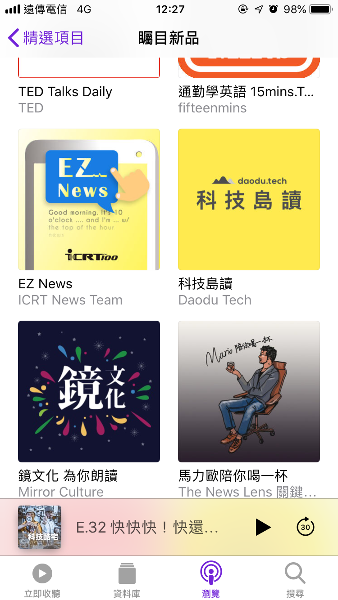

## 為什麼聽Podcast ？
到台北生活之後，主要通勤的方式是走路+搭乘大眾運輸工具，剛開始主要是透過 Facebook , Feedly 或是PTT等用「看」的媒體來吸收資訊，但因為邊走邊滑手機實在是有點危險又傷視力，所以就開始尋找了替代方案，於是就找到了 Podcast。

> Podcast一詞是由「iPod」+「broadcast」衍伸而來，中文稱為「播客」。

當你在開車、走路或是跑步這些不太方便使用手機的情境時，除了音樂之外，Podcast是陪你消磨這段時間又可以充實自己的好物。

## 取得 Podcast 的地方
如果你是 iPhone 的使用者的話，可以使用內建的 Podcast app 即可，如果是 Android 使用者的話，大多數 Podcast 也會放在 Soundcloud 和 Spotify 上，所以可以考慮下載這兩個 app。

<!--more-->

## 推薦的中文 podcast 
我入坑的 Podcast 節目為兩個中國人所主持的「 每日5分钟英语」，主要是在介紹一些英文的日常生活片語，很可惜的是現在已經不更新了。

以下要來跟大家分享一些我自己覺得很棒而且有在定期更新的Podcast節目，讓各位在通勤時間除了刷FB、滑PTT之外，還可以有個保護視力的好選擇，也可以支持一下這些以中文為主的優質節目。

### 新聞類

#### 百靈果NEWS
* 簡介：兩位主持人用雙語的對話來聊聊台灣、國際新聞，幽默詼諧的討論很適合在上下班途中或是放空的時候聽他們聊聊天。
* 更新時間：每週日
* 連結：[百靈果NEWS ft. caFREEteria/無料福利社](https://soundcloud.com/cafreeteria)

#### 轉角國際．重磅廣播
* 簡介：各種國際新聞內幕，內容比較正經，對單一新聞議題聊得比較深入，適合想要好好了解某個國際新聞的你。聽這個時會需要比較強大的專注力。
* 更新時間：每週六
* 連結：[轉角國際．重磅廣播 | udn Global 轉角國際](https://soundcloud.com/udn-global)

### 科技時事

#### 科技島讀
* 簡介：《有物報告》創辦人周欽華以及《CAREhER》創辦人盧郁青從台灣的角度出發跟聽眾聊「科技趨勢」和「商業策略」的變化，幫助聽眾了解新科技的發展和對未來社會的影響。
* 更新時間：每週一
* 連結：[科技島讀 Podcast](https://soundcloud.com/daodutech/tracks)

#### SwipeUp 科技酷宅
* 簡介：由科技玩家林小旭以及Saydigi總編Kisplay所創立的Podcast節目。主持人以比較輕鬆詼諧的口吻來報導許多時下的科技夯事，
* 更新時間：每週二、五
* 連結：[SwipeUp 科技酷宅](https://soundcloud.com/swipeup)

現在台灣優質的 Podcast 越來越多了，本篇文章會不定期更新推薦的節目。

如果大家還有什麼覺得不錯的 Podcast節目也歡迎在底下留言跟我分享讓我知道唷！
