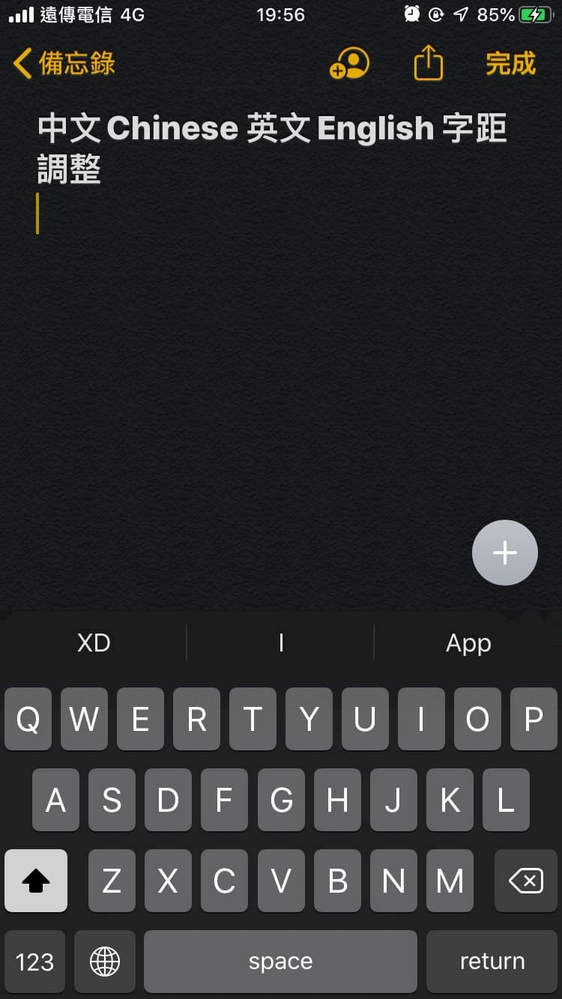
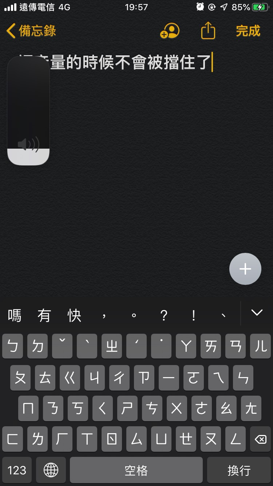
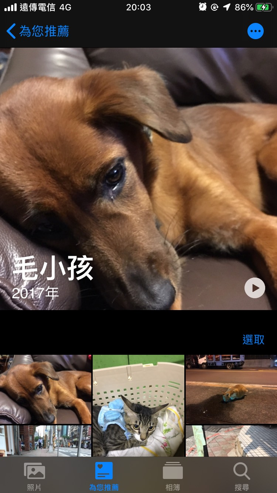
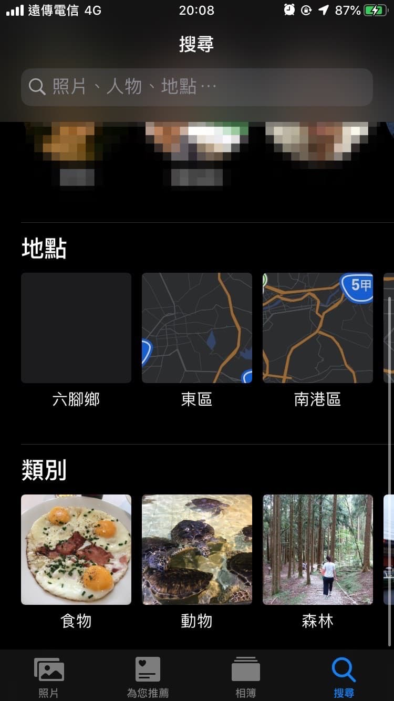

在本文開始之前，要先提醒大家**iOS 13目前為測試版本，多少都會遇到一些bug**，如果真的想要嚐鮮的話強烈建議先行備份，或是等到今年秋天正式版出來再行升級。

身為一個科技宅，在6月初的WWDC大會的隔天看到iOS 13的整理報導後，就很想趕緊更新來嚐鮮。原本一直告訴自己要等7月的Public Beta出來後再更新，這樣bug應該會少一些，結果在聽到友人Jerry Wang義無反顧地說要試試看後，我也按耐不住的上網找了開發者版本的第一版進行安裝。

## 使用心得
我自己是從6/4號就安裝使用developer beta版本，這次的iOS developer beta 1在使用上比想像中的流暢，我自己是使用iPhone 6s的機型，基本上只有在一開始用iCloud還原的時候有點卡頓，還原完成後一直使用到現在還算順暢。

iOS 13主要是改進許多使用者體驗的部分，基本上是優化一些使用上的小細節，無太多新功能加入，以下就列出自己使用上認為的優缺點供大家參考。

2019/08/17更新：目前使用的版本為 Public Beta 6，整體上來講已經很足夠應付日常使用了！耗電量、APP 支援我自己是覺得跟 iOS 12比起來有過之而無不及，所以想要嚐鮮的人可以直接到蘋果官網去註冊測試計畫囉！

### 優點
* 中英文間的字距調整：我最喜歡的改動之一是現在中文和英文的字距有做調整了，中英文夾雜的時候文字排版看起來舒服很多。

* 音量調整：音量終於不會再擋住畫面正中央了，不管是在看影片或是在玩遊戲的時候都很需要啊！

* 深色模式：內建深色模式用起來有莫名的爽感，質感瞬間提升100分，可以根據時間來調整iPhone要顯示深色或淺色介面

* 智慧相簿：在分類上進步很多，在搜尋的部分現在會跟Google相簿一樣會智慧地做場景（博物館、草原⋯）、物體（動物、人物）分類；為你推薦的部分則是會自動幫你生成短影片（讓我想到之前的HTC ZOE)

其他還有一些優點如相簿編輯功能中影片可以裁切、鍵盤支援滑動輸入（英文可用，中文尚未支援）以及健康APP裡面加入了更多資訊...等，就等大家之後自己親身體驗了！

### 缺點
iOS 13身為beta的第一版，還是有許多bug存在，除了在iPhone 6s的使用上會比較容易發熱外，耗電也有感覺比較明顯。另外大家可能會比較介意的是有一些第三方軟體有閃退的情況。

目前自己和友人小J試下來會有問題的軟體如下（2019.06.15更新）
- Line@閃退
- Line內建相機錄影剛開始會有雜音
- whatsapp收到通知的時候，橫幅通知上的人名會顯示錯誤
- 蝦皮購物閃退

2019/08/17更新：以上 APP目前都已經修復不會閃退囉！

其他我自己常用的App像Facebook, Instagram , Spotify, Moze記帳, Things, Spark, Wechat, Messenger, Google Map, Pitt...等目前是沒有遇到什麼問題。

如果有人需要幫忙測試有哪些APP會不會有問題的話可以在底下留言給我，我有看到的話會幫忙測試。

## 總結
如果你跟我一樣只有一台手機又想要把iOS 13 Beta拿來在日常生活中使用的話，我目前覺得是很綽綽有餘了，因為基本上不會遇到什麼大問題。但是再提醒大家一次，要升級前還是要先**整機備份**，這樣到時候真的有遇到什麼問題的話才可以無痛還原回去唷！

申請iOS 13測試：[Apple Beta Program](https://beta.apple.com/sp/zh-TW/betaprogram/)

## 附錄：iOS beta版本發行時間小記
記錄一下 Public Beta的發行時間，截至目前為止的更新頻率還算蠻頻繁的。
* 2019/06/25：iOS 13 Public Beta 1
* 2019/07/09：iOS 13 Public Beta 2
* 2019/07/19：iOS 13 Public Beta 3
* 2019/07/31：iOS 13 Public Beta 4
* 2019/08/09：iOS 13 Public Beta 5
* 2019/08/16：iOS 13 Public Beta 6