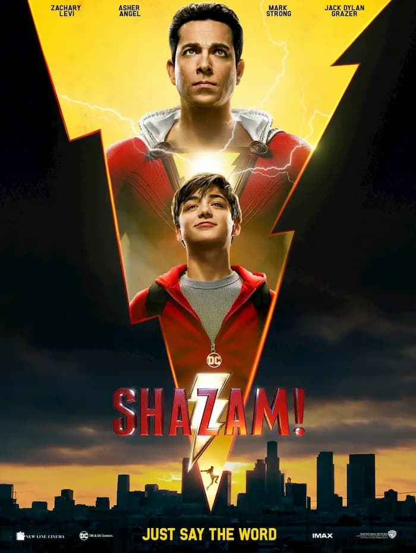

這次的超級英雄片，真的不一樣。

《沙贊！》跟以往我們認知的超級英雄片有一段落差，以往英雄片中的主角們都是無所畏懼，面對壞人的時候會當仁不讓的衝出來解決案件，誰叫「能力越大，責任越大」。

<!--more-->

但《沙贊！》的主角「比利」（Billy）是一個15歲的屁孩，莫名其妙的成為了巫師的繼承者而擁有了神奇的力量。拿到這股力量的他活像小時候身邊那個擁有遊戲王「神之卡」的同學一樣，每天在那邊到處炫耀；比利則是將影片上傳到 Youtube，在街頭賣藝賺錢。

甚至在壞人「希瓦納」和「七宗罪」找上門來時，比利最一開始的選擇是逃避，直到他在寄養家庭中的家人兼超能力導師「佛萊迪」（Freddy）被抓走後，他才被迫選擇站出來迎擊。

在字幕翻譯的部分，《沙贊！》為了因應「屁孩英雄」的用詞而用了一些火星文，例如「舒服」硬要翻成「蘇胡」，這種刻意反而讓我不太喜歡。

對我來說，《沙贊！》的劇情無太多高潮起伏，而且沒有太多驚喜，看到中後段會有點小悶。唯獨劇情埋的一些梗還算好笑，算是個適合放鬆心情，全家大小共樂的英雄片，不像以往比較成人向的英雄片劇情比較灰暗些。