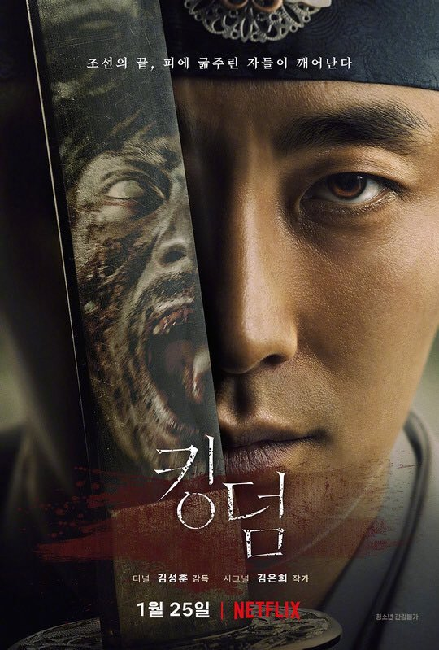

我個人覺得這是一部非常成功地把殭屍劇跟宮廷劇做結合的影集，目前只有第一季，第二季尚在拍攝當中。

先說我是一個不喜歡殭屍，連看《神鬼傳奇》的印何闐都會感到不舒服的人，《李屍朝鮮》中不乏殭屍追逐、殭屍咬人...這種噁心的畫面，但它強大劇情還是讓我忍不住在兩天內就追完了。

<!--more-->

《李屍朝鮮》會讓我一再地看下去的原因有很大一部份是宮廷鬥爭的劇情很吸睛，一度讓我想到之前很紅的中國劇集《琅琊榜》各種勢力間的角力。李屍朝鮮中也有位高權重而干政的外戚、失權流落在外想要拼復權的皇太子、不想只當父親魁儡的皇后、忠肝義膽的大臣們...等，眾多角色組合在一起互相角力讓這部戲變的很有看頭。

而殭屍的劇情也有埋下一些伏筆，原本以為是因為夜幕降臨而被喚醒的殭屍們，到結尾時他們甦醒的關鍵竟然變為溫度（這點尚待下集揭曉）。這部分讓我想到了即將要推出第八季的《冰與火之歌》裡面的「異鬼」，差異大概是《李屍朝鮮》目前還沒有啥重要角色領便當就是。

這部影集結合了《琅琊榜》和《冰與火之歌》的兩大特色，可說是集大成之作啊！

總之，如果你是因為害怕殭屍還沒看《李屍朝鮮》的話，只要撐過前三集後面的殭屍就會比較 ~~溫和~~ 少出現一點了。但如果你是個不怕殭屍的人，現在就打開 Netflix 把它加入片單，有空的時候就可以直接打開來看啦！

我已經迫不及待第二季的上映了。